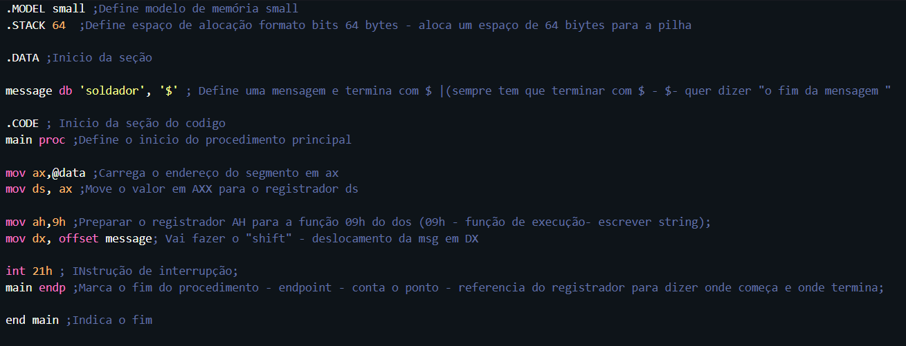
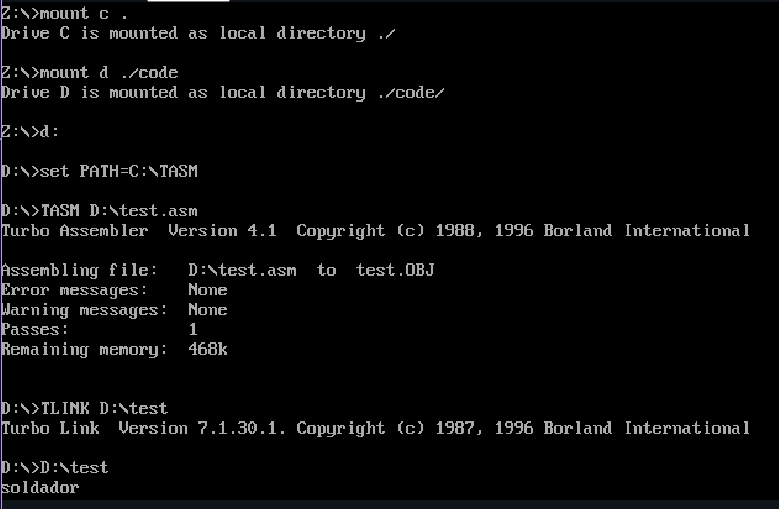

#  Conceitos Relacionados a atividade realizada em sala: 

> - Em Assembly, "DOS" refere-se ao MS-DOS (Microsoft Disk Operating System), um sistema operacional popular antes da ascensão do Windows;

> - No contexto de Assembly, o MS-DOS oferece uma série de serviços que podem ser chamados por programas Assembly para realizar diversas tarefas, como entrada e saída de dados, manipulação de arquivos e diretórios, gerenciamento de memória, entre outros.

> - Para acessar esses serviços do MS-DOS em um programa Assembly, você normalmente usa as interrupções do sistema. As interrupções do sistema permitem que o programa Assembly transfira o controle para o sistema operacional, que então executa a função solicitada e retorna o controle ao programa.

> - Foi instalada uma extensão chamada MASM/TASM que utiliza DOS. O ".asm" no final da palavra "print" está relacionado a ela. Essas ferramentas ajudam a traduzir o código em assembly para código de máquina executável. Os códigos descritos acima são em assembly para DOS.

> - Em resumo, com MASM ou TASM, você pode escrever programas Assembly para interagir com o MS-DOS usando as interrupções do sistema e seus serviços disponíveis.

> - No Assembly, os registradores são componentes fundamentais para armazenar e manipular dados durante a execução de um programa. Eles são pequenas áreas de armazenamento dentro da CPU e podem ser acessados de forma muito rápida.

> - **Registradores Comuns:**

> -Registradores de Dados (Data Registers):
> -São usados para armazenar dados temporários.
> -Exemplos: AX, BX, CX, DX.

> -Registradores de Apontador (Pointer Registers):
> -Usados para armazenar endereços de memória.
> -Exemplos: SI, DI, BP, SP.

> -Registradores de Índice (Index Registers):
> -Usados para realizar operações de indexação em estruturas de dados.
> -Exemplos: SI, DI.

#  Explicação geral do codigo: 

> - **Estrutura Geral:**

> - Ele usa o modelo de memória small e aloca um espaço de 64 bytes para a pilha.

> - O programa exibe a mensagem “soldador” na saída padrão (console).

> - **Seções:**

> -O código é dividido em três seções principais: .DATA, .CODE e o procedimento main.

> - **Seção .DATA:**
> - Aqui, você define variáveis globais e dados estáticos.
> - A variável message contém a string “soldador” e termina com o caractere $.

> - **Seção .CODE:**
> - Esta seção contém o código executável.
> -O procedimento main é o ponto de entrada do programa.

> - **Procedimento main:**
> - O registrador AX é usado para carregar o endereço do segmento de dados (@data).
> - O registrador DS é atualizado com o valor de AX, apontando para o início do segmento de dados.
> - O registrador AH é configurado com o valor 9h, que corresponde à função de escrita de string no DOS.
> - O registrador DX é carregado com o deslocamento da variável message.
> - A instrução int 21h é uma interrupção do DOS que imprime a string no console.
> - O procedimento main é encerrado com a diretiva main endp.

> - Quando o programa é executado, ele carrega a string "soldador" na memória e a imprime na tela usando a função 9h da interrupção 21h do DOS. O caractere de terminação '$' não é impresso, apenas indica o fim da string para a função de impressão.

