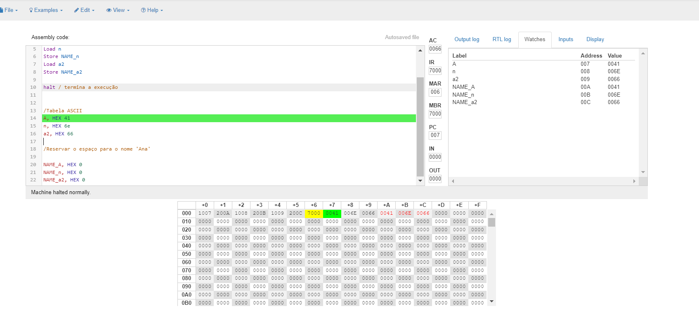

#  Conceitos iniciais assembly em aula: 

### Como funciona a alocação de memória dinâmica para armazer o nome: 

> - A alocação dinâmica de memória é um conceito importante na programação, no que diz respeito quanto a necessidade de quando precisar reservar espaço de memória durante a execução do programa.

> - Gerenciamento de Memória em C: Quando você declara uma variável usando um tipo de dados básico, o compilador C aloca automaticamente espaço de memória para essa variável em uma área chamada pilha. Por exemplo, uma variável float normalmente ocupa 4 bytes (dependendo da plataforma) quando é declarada. Além disso, um array com tamanho especificado é alocado em blocos contíguos de memória, onde cada bloco tem o tamanho de um elemento.
>- Alocação Dinâmica de Memória: A alocação dinâmica de memória permite que você aloque e libere memória manualmente durante a execução do programa. Isso é útil quando o tamanho do array não é conhecido até o tempo de execução.  

### Conceitos importantes: 
> - **Solicitação de memória:**
>-Utiliza-se funções espefícas como malloc() ou calloc(), para reservar um bloco de memória do tamanho desejado. Essas funções retornam um ponteiro para o início desse bloco de memória. O espaço alocado é gerenciado por meio de ponteiros que apontam para o espaço recém-alocado em uma área chamada “heap”.
> - **Liberação de Memória:**
>- Quando você não precisa mais do espaço alocado, você deve liberá-lo usando a função free(). Isso evita vazamentos de memória e garante que a memória seja reutilizada. 
>--Alocação de memória para o nome Ana Alocando na memória: 

### Validando o programa:

> - **ORG 000:** Essa instrução indica que o programa começa na posição de memória 000.

> - **Load A:** Isso carrega o valor da posição de memória A (que corresponde ao caractere ‘A’ na tabela ASCII) no acumulador.

> - **Store NAME_A:** O valor do acumulador é armazenado na posição de memória chamada NAME_A.

> - **Load n:** Carrega o valor da posição de memória n (que corresponde ao caractere ‘n’ na tabela ASCII) no acumulador.

> - **Store NAME_n:** O valor do acumulador é armazenado na posição de memória chamada NAME_n.

> - **Load a2:** Carrega o valor da posição de memória a2 (que corresponde ao caractere ‘f’ na tabela ASCII) no acumulador.

> - **Store NAME_a2:** O valor do acumulador é armazenado na posição de memória chamada NAME_a2.

> - **halt:** Essa instrução encerra a execução do programa.

> - **Tabela ASCII:**
> -‘A’ tem o valor hexadecimal 41.
> -‘n’ tem o valor hexadecimal 6e.
> -‘a2’ tem o valor hexadecimal 66.
> -Reservar espaço para o nome ‘Ana’:

> -As posições de memória NAME_A, NAME_n e NAME_a2 são inicializadas com o valor hexadecimal 0.

> - **IR**- instrução do registro - 7000 foi executado corretamente

> -Em resumo, o programa carrega os valores correspondentes aos caracteres ‘A’, ‘n’ e ‘f’ nas posições de memória NAME_A, NAME_n e NAME_a2, respectivamente. Esses valores podem ser usados posteriormente no programa para formar o nome ‘Ana’.

